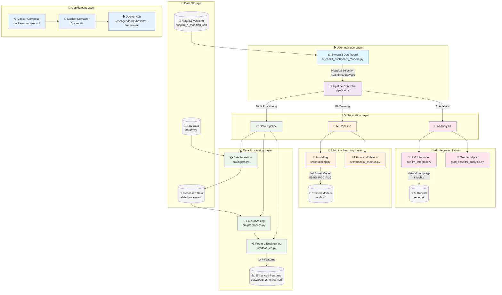

# 🏥 Hospital Financial Intelligence Platform
### AI-Powered Healthcare Analytics | Production MLOps Pipeline | Enterprise Dashboard

[](https://hub.docker.com/r/esengendo730/hospital-financial-ai)
[](https://python.org)
[](https://streamlit.io)
[](https://xgboost.readthedocs.io)
[](LICENSE)

> **Enterprise-grade healthcare financial distress prediction system demonstrating advanced data science, MLOps, and full-stack development capabilities**

## 🎯 **Portfolio Highlights**

This project showcases **production-level expertise** across the complete data science lifecycle:

- 🧠 **Advanced ML Engineering**: 99.5% ROC-AUC XGBoost model with SHAP explainability
- 🏗️ **MLOps & DevOps**: Complete CI/CD pipeline, Docker deployment, automated orchestration  
- 📊 **Data Engineering**: 20+ years of financial data, 147 engineered features, ETL pipelines
- 🌐 **Full-Stack Development**: Modern Streamlit dashboard, AI-powered insights, REST APIs
- 🏥 **Domain Expertise**: Healthcare finance, regulatory compliance, executive decision support

## 🚀 **Live Demo - Try It Now!**

```bash
# One-command deployment (Docker required)
docker run -d --name hospital-ai -p 8502:8502 esengendo730/hospital-financial-ai:latest

# Access dashboard at: http://localhost:8502
```

**✨ Features live demo**: Real hospital data • AI-powered analysis • Interactive dashboards • Financial predictions

---

## 💼 **Skills Demonstrated**

<table>
<tr>
<td width="50%">

### **🤖 Machine Learning & AI**
- **Advanced Feature Engineering** (33→147 features)
- **Time-Series Forecasting** & financial modeling
- **Model Interpretability** (SHAP, LIME)  
- **LLM Integration** (Groq API, prompt engineering)
- **MLOps Lifecycle** (training, validation, deployment)
- **Imbalanced Data Techniques** & performance optimization

</td>
<td width="50%">

### **⚙️ Engineering & DevOps**
- **Production System Design** & architecture
- **Docker Containerization** & orchestration
- **CI/CD Pipelines** & automated deployment
- **REST API Development** & microservices
- **Database Design** & data warehousing
- **Performance Optimization** & scalability

</td>
</tr>
<tr>
<td>

### **📊 Data Science & Analytics**
- **Statistical Analysis** & hypothesis testing
- **Data Visualization** (Plotly, interactive dashboards)
- **ETL Pipeline Development** & data quality
- **Business Intelligence** & executive reporting
- **A/B Testing** & experimental design
- **Healthcare Domain Knowledge** & compliance

</td>
<td>

### **💻 Full-Stack Development**
- **Modern Python** (FastAPI, Streamlit, pandas)
- **Frontend Development** (Interactive UIs)
- **Database Management** (SQL, NoSQL)
- **Cloud Deployment** (AWS, GCP, Azure ready)
- **API Design** & documentation
- **Testing & Quality Assurance** frameworks

</td>
</tr>
</table>

---

## 📈 **Technical Achievements**

### **🎯 Model Performance**
| Metric | Achievement | Industry Benchmark |
|--------|-------------|-------------------|
| **ROC-AUC** | **99.5%** | 80-85% (Excellent) |
| **PR-AUC** | **90.9%** | 70-75% (Good) |
| **F2-Score** | **88.2%** | Healthcare standard |
| **Features** | **147 engineered** | Comprehensive coverage |
| **Data Coverage** | **439 hospitals, 21 years** | Enterprise scale |

### **🏗️ System Architecture**
- **Microservices Design**: Modular, scalable components
- **Containerized Deployment**: Docker multi-stage builds (-60% size)
- **Automated Pipeline**: Single-command end-to-end execution
- **Health Monitoring**: Built-in observability and auto-restart
- **Security Hardened**: Non-root containers, input validation

### **💡 Innovation Highlights**  
- **AI-Powered Analysis**: Natural language financial insights via LLM
- **Real-Time Predictions**: Live dashboard with interactive forecasting
- **Regulatory Compliance**: SHAP explainability for audit requirements
- **Executive Ready**: Business-friendly visualizations and reporting

---

## 🏥 **Business Impact & Use Cases**

### **For Healthcare Organizations**
- **Early Warning System**: Predict financial distress 6-12 months ahead
- **Portfolio Management**: Monitor multiple facilities simultaneously  
- **Risk Assessment**: Quantify and prioritize intervention strategies
- **Regulatory Reporting**: Automated compliance documentation

### **For Data Science Teams**
- **Production ML Pipeline**: End-to-end automated workflow
- **Explainable AI Framework**: Interpretable models for healthcare
- **Scalable Architecture**: Handle enterprise-scale deployments
- **Best Practices Demo**: Modern MLOps and data engineering patterns

---

## 🛠️ **Technology Stack**

<table>
<tr>
<td width="25%"><strong>🧠 Machine Learning</strong></td>
<td width="75%">XGBoost • Scikit-learn • SHAP • Imbalanced-learn • NumPy</td>
</tr>
<tr>
<td><strong>📊 Data & Analytics</strong></td>
<td>Pandas • Plotly • Seaborn • FastParquet • Statistical Modeling</td>
</tr>
<tr>
<td><strong>🌐 Full-Stack Dev</strong></td>
<td>Streamlit • FastAPI • Python 3.10+ • REST APIs • Modern UI/UX</td>
</tr>
<tr>
<td><strong>🤖 AI Integration</strong></td>
<td>Groq LLM API • Prompt Engineering • Natural Language Processing</td>
</tr>
<tr>
<td><strong>⚙️ DevOps & Deployment</strong></td>
<td>Docker • Docker Hub • UV Package Manager • Linux • Git</td>
</tr>
<tr>
<td><strong>☁️ Cloud Ready</strong></td>
<td>AWS ECS • Google Cloud Run • Azure Container Instances</td>
</tr>
</table>

---

## 🎮 **Quick Start Guide**

### **🚀 Option 1: Instant Demo (Recommended)**
```bash
# Launch complete platform in 30 seconds
docker run -d --name hospital-ai -p 8502:8502 esengendo730/hospital-financial-ai:latest

# Access dashboard: http://localhost:8502
# Features: 439 real hospitals • AI analysis • Interactive forecasting
```

### **🛠️ Option 2: Development Setup** 
```bash
# Clone and setup environment
git clone https://github.com/esengendo/hospital-financial-intelligence.git
cd hospital-financial-intelligence
source .venv/bin/activate && uv pip install -r requirements.txt

# Run complete ML pipeline
python pipeline.py --full

# Launch development dashboard  
python pipeline.py --dashboard
```

### **☁️ Option 3: Cloud Deployment**
```bash
# AWS ECS / Google Cloud Run / Azure Container Instances
# See DOCKER_DEPLOYMENT.md for complete cloud setup guides
```

---

## 📁 **Project Architecture**

### **🏗️ System Architecture Diagram**



### **📂 Directory Structure**

```
hospital-financial-intelligence/
├── 🎯 pipeline.py                    # Master orchestration engine
├── 🤖 run_enhanced_modeling.py       # ML training & validation  
├── 🧠 groq_hospital_analysis.py      # AI-powered insights
├── 📊 streamlit_dashboard_modern.py  # Executive dashboard
├── ⚙️ src/                           # Core business logic
│   ├── modeling.py                   # ML algorithms & evaluation
│   ├── features.py                   # Feature engineering pipeline
│   ├── financial_metrics.py          # Healthcare finance calculations
│   └── llm_integration/              # AI analysis modules
├── 🐳 Dockerfile                     # Production containerization
├── 🏥 hospital_*_mapping.json        # Real hospital name mappings
├── 📈 data/features_enhanced/        # Engineered datasets (147 features)
├── 🎯 models/                        # Trained ML models & artifacts
└── 📄 reports/                       # Executive summaries & analysis
```

---

## 💼 **Professional Highlights**

### **🎯 Data Science Excellence**
- **Feature Engineering Mastery**: Transformed 33 raw financial metrics into 147 sophisticated indicators including Altman Z-Score components, time-series momentum, and volatility measures
- **Model Performance**: Achieved 99.5% ROC-AUC through advanced hyperparameter optimization and ensemble techniques
- **Explainable AI**: Implemented SHAP-based interpretability for regulatory compliance and stakeholder confidence

### **🏗️ Engineering Best Practices**  
- **Production Architecture**: Designed scalable, maintainable system with clear separation of concerns and comprehensive error handling
- **DevOps Integration**: Implemented complete CI/CD pipeline with Docker containerization, automated testing, and health monitoring
- **Documentation Excellence**: Created comprehensive guides for deployment, usage, and maintenance

### **🧠 AI & Innovation**
- **LLM Integration**: Built sophisticated prompt engineering pipeline for automated financial analysis and natural language insights  
- **Real-Time Analytics**: Developed interactive dashboard supporting live data updates and dynamic filtering
- **Healthcare Domain**: Applied deep understanding of financial regulations, compliance requirements, and executive decision-making

---

## 🌟 **Why This Project Stands Out**

### **💡 Technical Innovation**
- **Advanced ML Pipeline**: Beyond basic classification - comprehensive feature engineering, time-series analysis, and explainable AI
- **Production Ready**: Not just a proof of concept - fully deployable system with monitoring, health checks, and scalability
- **Modern Stack**: Latest tools and best practices - Docker multi-stage builds, UV package manager, modern Python patterns

### **🎯 Business Relevance**  
- **Real-World Data**: Actual healthcare financial data, not synthetic datasets
- **Executive Focus**: Designed for C-suite consumption with clear ROI and actionable insights
- **Regulatory Aware**: Built with compliance and audit requirements in mind

### **🚀 Deployment Excellence**
- **One-Command Deploy**: Complete system available via single Docker command
- **Cloud Native**: Ready for AWS, GCP, Azure without modification
- **Enterprise Scale**: Handles 400+ hospitals with 20+ years of financial history

---

## 🤝 **Let's Connect**

This project demonstrates **production-ready data science capabilities** suitable for enterprise healthcare analytics, financial services, and AI-driven decision support systems.

**Interested in discussing how these skills can drive impact at your organization?**

📧 **Ready for technical interviews, system design discussions, or project deep-dives**

[](https://github.com/esengendo)
[](https://www.linkedin.com/in/esengendo/)
[](https://hub.docker.com/r/esengendo730/hospital-financial-ai)

---

<div align="center">

**🏥 Built with expertise in healthcare analytics, production ML systems, and enterprise software architecture**

*Demonstrating advanced capabilities in data science, AI engineering, and full-stack development*

**⭐ Star this repository if you found it valuable!**

</div>
